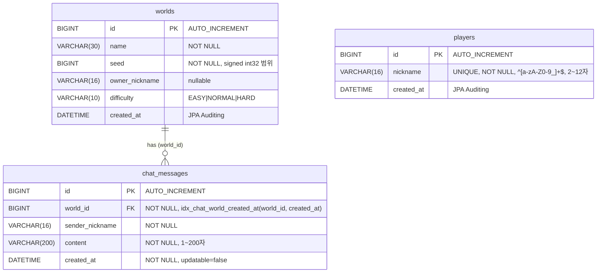

# WebCraft — Spring Boot 숙련 주차 과제

실시간 멀티플레이 게임 서버 **WebCraft**의 백엔드를 구현하는 Spring Boot 숙련 과제입니다.
프로퍼터리 **WebCraft Engine** JAR 위에 플레이어 등록, 월드 생성, 월드 채팅, 접속 현황(Presence),
WebSocket 실시간 통신(이동/채팅/핑퐁/접속자 조회)을 구현합니다. 완성된 프론트엔드가 포함돼 있어
서버 실행 후 `http://localhost:8080`에서 실제로 플레이할 수 있습니다.

- 완성 게임: https://nhahan.github.io/webcraft/
- API 문서: https://f-api.github.io/game-spring-api-docs/expert/api-docs.html
- 요약 API 명세: [`API-SPEC.md`](API-SPEC.md)
- 단계별 과제 가이드: [`[260916] 숙련 주차 프로젝트 발제.md`](%5B260916%5D%20%EC%88%99%EB%A0%A8%20%EC%A3%BC%EC%B0%A8%20%ED%94%84%EB%A1%9C%EC%A0%9D%ED%8A%B8%20%EB%B0%9C%EC%A0%9C.md)

## 기술 스택

| 구분 | 내용 |
| --- | --- |
| 언어 | Java 21 (toolchain) |
| 프레임워크 | Spring Boot 4.1.0 — WebMVC, Data JPA, Validation, WebSocket |
| 엔진 | 프로퍼터리 **WebCraft Engine** (`io.github.f-api:webcraft-engine:2.2.6`, `com.gameexpert.*` 네임스페이스 공유) |
| DB | 런타임 **Docker MySQL** / 테스트 인메모리 **H2** + **Testcontainers** |
| 캐시·Presence·Pub/Sub | **Docker Redis** (Spring Data Redis) — ZSet 접속 현황, 최근 채팅 캐시, Lua 스크립트 요청 제한, 채팅 Pub/Sub 중계 |
| 직렬화 | Jackson 3 (`tools.jackson.databind.*`) |
| 기타 | Lombok, Gradle 래퍼 |

## 실행 방법

### 단일 서버

```bash
# 1. MySQL, Redis 실행 (compose 파일 중 mysql/redis 서비스만 사용)
docker compose up -d mysql redis

# 2. 서버 실행 → http://localhost:8080
./gradlew bootRun

# 테스트 / 빌드
./gradlew test
./gradlew build
```

`compileJava`는 `verifyEngine`(`gradle/engine.gradle`)에 의존해 엔진 JAR을 GitHub 릴리스의
`SHA256SUMS`로 검증합니다. 최초 빌드는 온라인 환경에서 실행해야 하며, 이후에는 Gradle 홈에
캐시된 체크섬을 사용합니다. 테스트는 H2/Testcontainers로 동작해 별도의 MySQL·Redis 없이도
단위 테스트 수준은 통과합니다(Presence·Cache·RateLimit·Relay 등 Redis 연동 테스트는 Docker 필요).

### 멀티 서버 (Lv 20 — Redis Pub/Sub 채팅 중계)

```bash
docker compose up -d --build
```

`docker-compose.yml`은 MySQL 1대, Redis 1대, 같은 이미지의 앱 서버 2대(`app1`:8081, `app2`:8082)를
띄웁니다. 두 앱은 같은 MySQL·Redis를 공유하며, `webcraft.chat.pubsub-enabled=true` 설정에 따라
한 서버에서 보낸 채팅이 Redis 채널(`webcraft:chat`)을 통해 다른 서버에 연결된 같은 월드
참여자에게도 전달됩니다.

## 아키텍처

- **3-Layer**: Controller → Service → Repository로 책임을 분리합니다.
- 엔티티는 응답으로 직접 노출하지 않고 **DTO로 변환**해 반환합니다.
- 엔진(`com.gameexpert.api.*`, `com.gameexpert.ws.*` 등)은 같은 `com.gameexpert` 패키지 공간에
  JAR로 배포되며, 앱 코드는 엔진 인터페이스를 **구현**(`PresenceService implements PresenceOperations`)하고
  Spring 리포지토리를 엔진 저장소 인터페이스에 **어댑팅**(`DomainStorageConfiguration`)해 통합합니다.

### 패키지 구조

```
com.gameexpert
├─ player/     # 플레이어 등록            (controller/dto/entity/repository/service)
├─ world/      # 월드 목록·생성            (controller/dto/entity/repository/service)
├─ chat/       # 채팅 저장·조회·캐시·요청 제한·서버 간 중계
│  ├─ service/   # ChatService, ChatHistoryService, RecentChatCache, ChatRateLimitService, LocalChatSender
│  └─ relay/     # ChatRelay(Redis Pub/Sub), ChatSubscriptionConfig
├─ trial/      # 낙관적 락 예제 엔티티      (entity/repository)
├─ presence/   # Redis 기반 월드 접속 현황  (PresenceService)
├─ ws/         # WebSocket 메시지 라우팅·핸들러·세션 레지스트리
│  ├─ handler/   # ChatWsHandler, MoveWsHandler, OnlineUsersWsHandler, PingWsHandler
│  └─ dto/       # ChatResponse, OnlineUsersResponse 등
├─ config/     # WebSocketConfig, DomainStorageConfiguration 등
└─ common/     # ErrorResponse, GlobalExceptionHandler, 도메인 예외
```

## ERD



- `worlds`는 최대 3개까지만 생성됩니다(`MAX_WORLDS`, `worldOperations.duringCreation()` 락 내부에서 검사).
- `chat_messages`는 최근 채팅 조회(`world_id, created_at DESC`)를 위해 복합 인덱스
  `idx_chat_world_created_at`를 `@Table(indexes = ...)`로 선언합니다. 인덱스가 없으면
  기동 검사에서 `CHAT_HISTORY_INDEX_MISSING`으로 서버 실행을 중단합니다.
- 그 외 `world_trial_sites`(도전 Lv16, `@Version revision`으로 낙관적 락 적용)는 엔진이 관리하는
  월드 상태 저장용 엔티티로, 별도 API 표면 없이 동시 저장 충돌 검증 테스트에서만 다룹니다.

## API 명세

Base URL: `http://localhost:8080`

| 메서드 | 경로 | 성공 | 설명 |
| --- | --- | ---: | --- |
| `POST` | `/players` | 201 | 플레이어 등록 |
| `GET` | `/worlds` | 200 | 월드 목록 조회 (Redis presence 기준 `onlineCount`) |
| `POST` | `/worlds` | 201 | 월드 생성 (최대 3개) |
| `GET` | `/worlds/{worldId}/chats` | 200 | 최근 채팅 조회 |
| `GET` | `/worlds/{worldId}/chats/history` | 200 | 과거 채팅 커서 페이지 조회 |
| `WS` | `/ws/worlds/{worldId}?nickname=` | 101 | WebSocket 연결 |

자세한 요청/응답 필드, 검증 규칙, 오류 코드는 [`API-SPEC.md`](API-SPEC.md)에 정리돼 있습니다. 핵심만 요약하면:

### 오류 응답

본문 형식은 `{"error": "<CODE>"}`이며, 문자열 코드로 통일합니다.

| error | 상태 | 언제 |
| --- | ---: | --- |
| `VALIDATION_FAILED` | 400 | 필수 값 누락, 길이·패턴 위반 |
| `INVALID_REQUEST_BODY` | 400 | 잘못된 JSON, 알 수 없는 필드/난이도 |
| `WORLD_NOT_FOUND` | 404 | 존재하지 않는 월드 |
| `PLAYER_NOT_FOUND` | 404 | 등록되지 않은 닉네임으로 월드 생성 |
| `DUPLICATE_NICKNAME` | 409 | 이미 등록된 닉네임 |
| `WORLD_LIMIT_REACHED` | 409 | 월드 3개 초과 생성 시도 |
| `INTERNAL_ERROR` | 500 | 예기치 못한 서버 오류 |
| `WORLD_BASELINE_INITIALIZING` | 503 | 서버 기동 직후 월드 준비 전 |

### WebSocket 메시지

연결: `ws://localhost:8080/ws/worlds/{worldId}?nickname={nickname}`

| 방향 | type | 설명 |
| --- | --- | --- |
| C→S | `ping` | heartbeat, Redis presence 갱신 |
| C→S | `chat` | 1~200자 채팅, 플레이어당 10초 5건 제한(Lua로 원자 처리) |
| C→S | `move` | 위치·시선·이동 상태를 게임 엔진에 전달 |
| C→S | `onlineUsers` | 현재 서버에 연결된 같은 월드 참여자 조회 |
| S→C | `chat` | 저장된 채팅을 같은 월드 전원에 브로드캐스트(멀티 서버는 Redis 중계) |
| S→C | `pong` / `onlineUsers` / `error` | 응답 |

## 과제 단계

Lv 1~15는 필수, Lv 16~20은 도전 과제이며 **본 저장소는 전 단계를 구현·테스트 완료**했습니다.

| 단계 | 주제 | 구분 |
| --- | --- | --- |
| Lv 1 | Docker MySQL·Redis 연결 설정 | 필수 |
| Lv 2 | `@Table`/`@Index`로 채팅 인덱스 선언 | 필수 |
| Lv 3 | 플레이어 등록 검증·DTO | 필수 |
| Lv 4 | 월드 생성 (`duringCreation` 락, `MAX_WORLDS`) | 필수 |
| Lv 5 | 채팅 저장·최근 채팅 조회 서비스 | 필수 |
| Lv 6 | 최근 채팅 조회 API | 필수 |
| Lv 7 | WebSocket 핸드셰이크 사용자 식별 | 필수 |
| Lv 8 | HandshakeInterceptor 등록 | 필수 |
| Lv 9 | 월드별 WebSocket 세션 레지스트리 | 필수 |
| Lv 10 | Redis 접속 상태(Presence) 관리 | 필수 |
| Lv 11 | 메시지 라우팅과 Ping/Pong | 필수 |
| Lv 12 | 플레이어 이동 요청 처리 | 필수 |
| Lv 13 | 채팅 요청 처리·응답 구성 | 필수 |
| Lv 14 | 같은 월드 참여자에게 채팅 전송 | 필수 |
| Lv 15 | 접속자 목록 조회 | 필수 |
| Lv 16 | 낙관적 락(`@Version`) | 도전 |
| Lv 17 | 커서 기반 채팅 페이지 조회 | 도전 |
| Lv 18 | Redis 최근 채팅 캐시(TTL 5초) | 도전 |
| Lv 19 | Redis Lua로 채팅 요청 원자적 제한 | 도전 |
| Lv 20 | Docker Compose 멀티 서버 + Redis Pub/Sub 채팅 중계 | 도전 |
